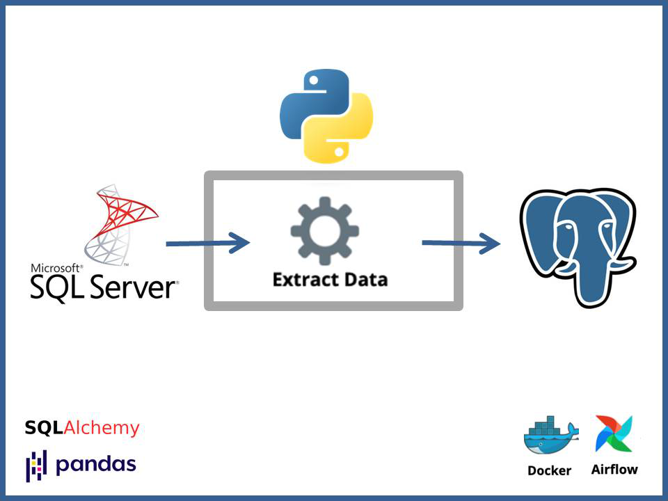

## About The Project

The project aimed to create a pipeline for transferring data from a SQL Server database to a PostgreSQL database. It provided a good opportunity to have practive with several tools. It required utilising on-premises databases, VS Code, Python and other extensions.

## SQL Server to PostgreSQL Pipeline

The Python script extracts data from a Microsoft SQL Server database and loads it into a PostgreSQL database. It uses SQLAlchemy for database connectivity, pyodbc to connect to SQL Server, and psycopg2 for PostgreSQL connection.

## Prerequisites

- Python 3.x with required modules (pandas, pyodbc, SQLAlchemy, psycopg2, etc.).
- PostgreSQL, SQL Server databases installed.
- Configuration of databases, users.
- Install Airflow locally or Cloud Composer ([Pricing Calculator](https://cloud.google.com/products/calculator#id=)).

1. Download and configure databases.
2. Load a sample data (.csv) to a database.
3. Extract the table data using python script.
4. Transform, if necessary, coding an appropriate code snippet.
5. Load the data to another database. 
   Optionally: Orchestrate with Airflow

> **NOTE**: This was developed on Windows. If you're on Macbook or Linux, you are lucky. You`ll be able to set up Airflow locally at ease.

## Result
 

  

