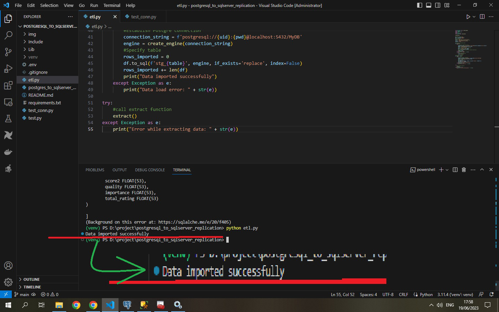
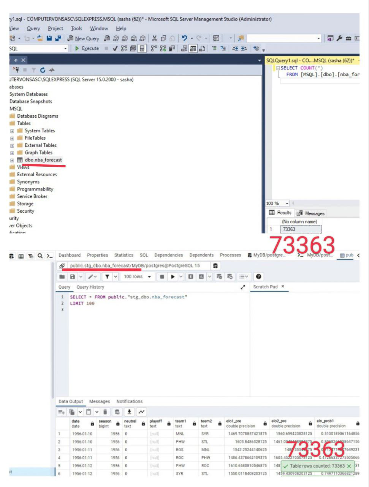

## About 

A small simple task: a pipeline "MS SQL Server > PostgreSQL"

## Prerequisites

- Python 3.x with required modules (pandas, SQLAlchemy)
- PostgreSQL, SQL Server databases configured
- Install Airflow with Docker, or in a separate repo to avoid conflicts with the script modules

1. Download and configure databases
2. Load a sample data to a database
3. Extract the table data using python script
4. Transform, if necessary
5. Load the data to another db
   Optionally: Schedule with Airflow

## Result
 

  

